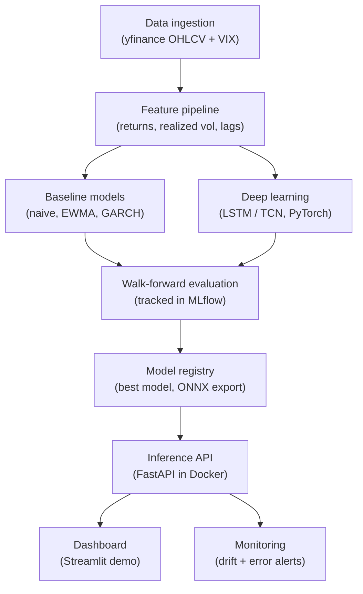

# Volatility Forecasting MLOps

> Forecasting 5-day realized volatility for a basket of equities/ETFs with a deep learning model, benchmarked against GARCH(1,1), shipped with a full MLOps lifecycle.

## Hook

_TODO: one-line result once Phase 1/2 are done, e.g. "A global LSTM matches GARCH(1,1) on walk-forward QLIKE while improving RMSE by X%."_

## Demo

_TODO: link to live Streamlit demo (Phase 6)._

## Architecture



See [docs/BUILD_PLAN.md](docs/BUILD_PLAN.md) for the full evaluation protocol and week-by-week plan.

## Results

_TODO: RMSE / MAE / QLIKE table, DL vs GARCH vs naive on identical walk-forward splits (Phase 1/2)._

## How to run

```bash
uv sync
```

_TODO: fill in once data ingestion, training, and serving exist (Phase 1+)._

## Status

Phase 0 — repo setup.
