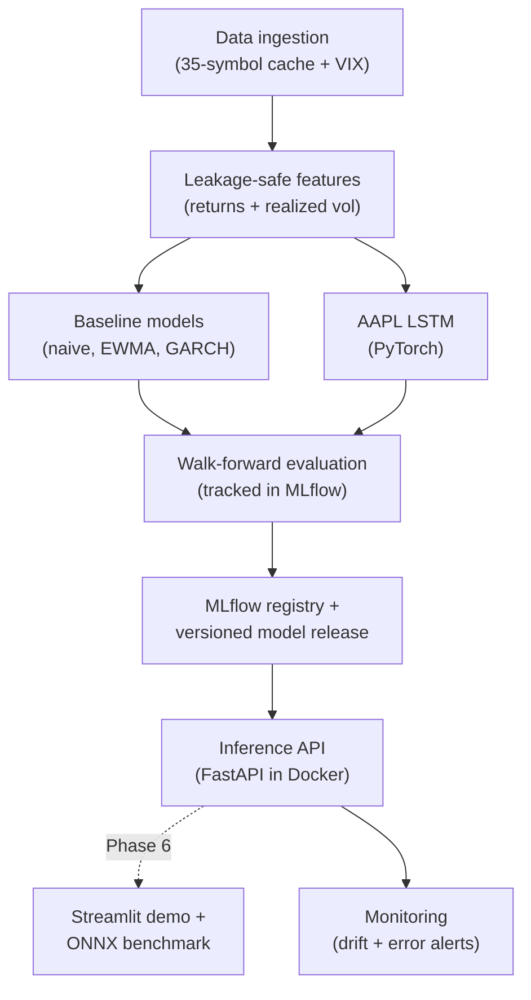

# Volatility Forecasting MLOps

[](https://github.com/ompat5/Volatility-Forecasting-MLOps/actions/workflows/ci.yml)

> An end-to-end MLOps system for five-day AAPL realized-volatility forecasting: leakage-safe walk-forward evaluation, classical baselines, MLflow, FastAPI, Docker, CI, and live drift/error monitoring.

## Result

The PyTorch LSTM reached **0.2061 RMSE** and **0.1408 MAE** on AAPL walk-forward
evaluation—about 6% and 7% better than EWMA respectively—while EWMA retained a
small QLIKE edge. The modest result is the point: the project emphasizes honest
time-series evaluation and the production lifecycle rather than an implausible
claim of crushing classical volatility models.

## Demo

Coming in Phase 6: a deployed AAPL Streamlit dashboard and ONNX latency/size
benchmark.

## Architecture


```mermaid
flowchart TD
    A["Data ingestion<br/>(35-symbol cache + VIX)"] --> B["Leakage-safe features<br/>(returns + realized vol)"]
    B --> C["Baseline models<br/>(naive, EWMA, GARCH)"]
    B --> D["AAPL LSTM<br/>(PyTorch)"]
    C --> E["Walk-forward evaluation<br/>(tracked in MLflow)"]
    D --> E
    E --> F["MLflow registry +<br/>versioned model release"]
    F --> G["Inference API<br/>(FastAPI in Docker)"]
    G -. Phase 6 .-> H["Streamlit demo +<br/>ONNX benchmark"]
    G --> I["Monitoring<br/>(drift + error alerts)"]
```

See [docs/BUILD_PLAN.md](docs/BUILD_PLAN.md) for the full evaluation protocol and week-by-week plan.

## Results

All models use the same five-fold expanding-window protocol with a five-day gap.

| Model | RMSE | MAE | QLIKE |
|---|---:|---:|---:|
| Naive | 0.2570 | 0.1698 | 1.6150 |
| EWMA | 0.2195 | 0.1508 | **0.5792** |
| GARCH(1,1) | 0.2441 | 0.1892 | 0.6962 |
| LSTM | **0.2061** | **0.1408** | 0.5822 |

The current trained, served, and monitored model is **AAPL-only**. The repository
caches a 35-symbol basket, but a global multi-ticker model remains future work.

## How to run

```bash
uv sync
uv run pytest
uv run ruff check .
```

Train and register the model:

```bash
uv run python -m src.data.ingest
uv run python -m scripts.train
```

Run the API from the local MLflow registry:

```bash
uv run uvicorn src.serving.app:app --port 8000
curl http://127.0.0.1:8000/health
```

Build the production container from an exported registered model:

```bash
uv run python -m scripts.export_model
docker build -t volatility-forecaster .
docker run --rm -p 8000:8000 volatility-forecaster
```

See [the monitoring runbook](docs/MONITORING.md) for the scheduled workflow,
thresholds, artifacts, and local monitoring commands.

## Status

Phases 1–5 are complete and merged. Phase 6 is next: ONNX export/benchmarking,
an AAPL Streamlit dashboard, deployment, and final portfolio polish.

### Continuous integration

Every push and pull request runs Ruff, the pytest suite, a Docker build, and an
end-to-end container smoke test. CI generates a deterministic fixture in
`.ci-model/`; it validates the production packaging contract but is not a trained
forecasting model and is never published.

Production images continue to use an explicitly exported registered model:

```bash
uv run python -m scripts.export_model
docker build -t volatility-forecaster .
```

### Scheduled monitoring

A weekday GitHub Actions pipeline refreshes AAPL data, downloads the immutable
checksum-pinned production model, generates a forecast, and reports feature
drift, volatility-regime state, and delayed rolling forecast error. Predictions,
the input snapshot, and Markdown/JSON reports are retained as workflow artifacts.

See [docs/MONITORING.md](docs/MONITORING.md) for thresholds, methodology, and
local commands.
