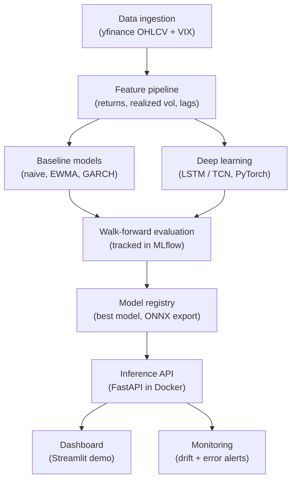

# Volatility Forecasting MLOps

[](https://github.com/ompat5/Volatility-Forecasting-MLOps/actions/workflows/ci.yml)

> Forecasting 5-day realized volatility for a basket of equities/ETFs with a deep learning model, benchmarked against GARCH(1,1), shipped with a full MLOps lifecycle.

## Hook

_TODO: one-line result once Phase 1/2 are done, e.g. "A global LSTM matches GARCH(1,1) on walk-forward QLIKE while improving RMSE by X%."_

## Demo

_TODO: link to live Streamlit demo (Phase 6)._

## Architecture


```mermaid
flowchart TD
    A["Data ingestion<br/>(yfinance OHLCV + VIX)"] --> B["Feature pipeline<br/>(returns, realized vol, lags)"]
    B --> C["Baseline models<br/>(naive, EWMA, GARCH)"]
    B --> D["Deep learning<br/>(LSTM / TCN, PyTorch)"]
    C --> E["Walk-forward evaluation<br/>(tracked in MLflow)"]
    D --> E
    E --> F["Model registry<br/>(best model, ONNX export)"]
    F --> G["Inference API<br/>(FastAPI in Docker)"]
    G --> H["Dashboard<br/>(Streamlit demo)"]
    G --> I["Monitoring<br/>(drift + error alerts)"]
```

See [docs/BUILD_PLAN.md](docs/BUILD_PLAN.md) for the full evaluation protocol and week-by-week plan.

## Results

_TODO: RMSE / MAE / QLIKE table, DL vs GARCH vs naive on identical walk-forward splits (Phase 1/2)._

## How to run

```bash
uv sync
```

_TODO: fill in once data ingestion, training, and serving exist (Phase 1+)._

## Status

Phases 1–4 complete. Phase 5 — CI/CD and monitoring — is in progress.

### Continuous integration

Every push and pull request runs Ruff, the pytest suite, a Docker build, and an
end-to-end container smoke test. CI generates a deterministic fixture in
`.ci-model/`; it validates the production packaging contract but is not a trained
forecasting model and is never published.

Production images continue to use an explicitly exported registered model:

```bash
uv run python -m scripts.export_model
docker build -t volatility-forecaster .
```

### Scheduled monitoring

A weekday GitHub Actions pipeline refreshes AAPL data, downloads the immutable
checksum-pinned production model, generates a forecast, and reports feature
drift, volatility-regime state, and delayed rolling forecast error. Predictions,
the input snapshot, and Markdown/JSON reports are retained as workflow artifacts.

See [docs/MONITORING.md](docs/MONITORING.md) for thresholds, methodology, and
local commands.
