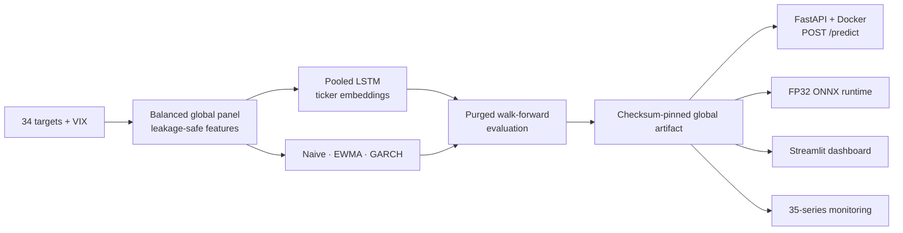

# Global Volatility Forecasting MLOps

[](https://github.com/ompat5/Volatility-Forecasting-MLOps/actions/workflows/ci.yml)

An end-to-end MLOps system for five-session realized-volatility forecasts across
**34 equity and ETF targets**, using a shared VIX context series. The deployed
surface is one global model, one API contract, one Streamlit dashboard, and one
monitoring workflow.

The earlier AAPL prototype remains in Git history and in historical benchmark
material; it is not an active serving, dashboard, Docker, or scheduled
monitoring path in this repository.

## Global model

The pooled PyTorch LSTM uses ticker embeddings, six leakage-safe features,
balanced ticker batches, a train-only scaler, and a positive log-volatility
output. Evaluation uses five expanding, purged global-calendar folds and a
final 252-session holdout (2025-06-18 through 2026-06-18).

| Model | Micro RMSE | Micro MAE | Micro QLIKE |
|---|---:|---:|---:|
| Naive | 0.18064 | 0.11894 | 1.62829 |
| EWMA | 0.14536 | 0.09694 | 0.54039 |
| GARCH(1,1) | 0.14436 | 0.09785 | **0.52160** |
| Global LSTM | **0.14235** | **0.08837** | 0.72611 |

The global LSTM improves pooled RMSE and MAE, while GARCH retains a materially
stronger QLIKE result. That trade-off is displayed in the dashboard and is not
hidden by the deployment decision. Complete per-ticker, group, macro, and micro
evidence is in [benchmarks/global_model.json](benchmarks/global_model.json).

## Architecture


```mermaid
flowchart LR
    A["34 targets + VIX"] --> B["Balanced global panel\nleakage-safe features"]
    B --> C["Pooled LSTM\nticker embeddings"]
    B --> D["Naive · EWMA · GARCH"]
    C --> E["Purged walk-forward\nevaluation"]
    D --> E
    E --> F["Checksum-pinned global artifact"]
    F --> G["FastAPI + Docker\nPOST /predict"]
    F --> H["FP32 ONNX runtime"]
    F --> I["Streamlit dashboard"]
    F --> J["35-series monitoring"]
```

## Deployment

The repository pins one immutable global artifact in
[configs/global_release.yaml](configs/global_release.yaml). Its release tag
retains the word `candidate` because that is the immutable provenance of the
evaluated package; it is nevertheless the single artifact used by the current
global deployment paths.

Download it before a Docker build:

```bash
uv run python -m scripts.download_global_model
docker build -t volatility-forecaster .
docker run --rm -p 8000:8000 volatility-forecaster
```

The default container uses the MLflow pyfunc. Select its parity-validated FP32
ONNX core with:

```bash
docker run --rm -e MODEL_BACKEND=onnx -p 8000:8000 volatility-forecaster
```

The global ONNX graph matches PyTorch for all ticker embeddings with maximum
absolute difference `5.96e-08`. It reduces median core latency from `1.8345 ms`
to `0.7304 ms`, while full raw-history latency changes only from `147.6555 ms`
to `146.7871 ms` because feature construction dominates. See
[docs/GLOBAL_ONNX.md](docs/GLOBAL_ONNX.md).

## API contract

`GET /health` reports the global runtime ready state. `POST /predict` accepts a
long-form list of raw adjusted-close observations:

```json
{
  "observations": [
    {"date": "2026-01-02", "ticker": "AAPL", "adjusted_close": 250.1},
    {"date": "2026-01-02", "ticker": "^VIX", "adjusted_close": 16.8}
  ]
}
```

Every request needs `^VIX` plus at least one known target, enough history to
form a 30-session feature sequence (normally 90 sessions), positive prices,
and no duplicate `(date, ticker)` observations. The response has one positive
five-session forecast per requested target in authoritative universe order.
Requests fail closed on missing context, incomplete histories, stale artifacts,
or invalid model output.

## Dashboard and monitoring

Run the public dashboard locally:

```bash
uv run streamlit run dashboard/app.py
```

It defaults to a fresh synchronized 35-series download. For an offline replay:

```bash
GLOBAL_DASHBOARD_USE_CACHED_PRICES=1 \
  uv run streamlit run dashboard/app.py
```

The weekday [global monitoring workflow](.github/workflows/global-monitoring.yml)
downloads the same checksum-pinned artifact, refreshes all 34 targets plus VIX,
and writes fleet, group, ticker, drift, regime, and delayed-error evidence. Run
it locally with:

```bash
uv run python -m scripts.download_global_model
uv run python -m scripts.run_global_monitoring --refresh
```

See [docs/GLOBAL_MODEL.md](docs/GLOBAL_MODEL.md),
[docs/GLOBAL_MONITORING.md](docs/GLOBAL_MONITORING.md), and
[docs/GLOBAL_RELEASE.md](docs/GLOBAL_RELEASE.md) for the full contracts and
runbooks.

## Development

```bash
uv sync --locked --dev
uv run ruff check .
uv run pytest
```

CI creates a deterministic full-universe fixture, validates both MLflow and
ONNX global runtimes, builds one global-only Docker image, and requires all 34
forecasts through both container backends.
