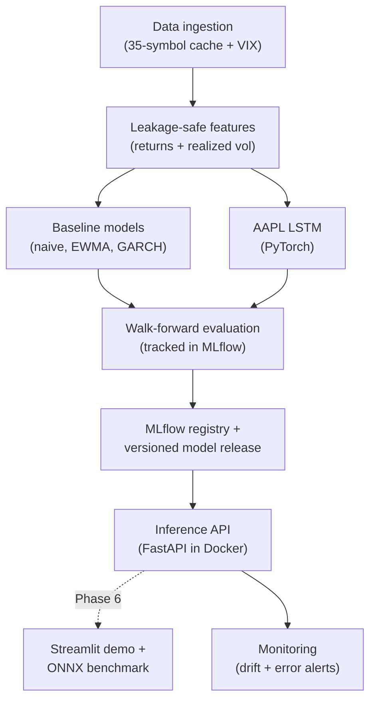

# Volatility Forecasting MLOps

[](https://github.com/ompat5/Volatility-Forecasting-MLOps/actions/workflows/ci.yml)

> An end-to-end MLOps system for five-day AAPL realized-volatility forecasting: leakage-safe walk-forward evaluation, classical baselines, MLflow, FastAPI, Docker, CI, and live drift/error monitoring.

## Result

The PyTorch LSTM reached **0.2061 RMSE** and **0.1408 MAE** on AAPL walk-forward
evaluation—about 6% and 7% better than EWMA respectively—while EWMA retained a
small QLIKE edge. The modest result is the point: the project emphasizes honest
time-series evaluation and the production lifecycle rather than an implausible
claim of crushing classical volatility models.

## Demo

**[Open the live AAPL volatility dashboard](https://volatility-forecaster.streamlit.app/)**

The Streamlit demo shows the latest forecast, recent realized volatility,
forecast versus realized history, stored model comparisons, and live monitoring
indicators. It is explicitly AAPL-only because the deployed model is AAPL-only.

## Architecture


```mermaid
flowchart TD
    A["Data ingestion<br/>(35-symbol cache + VIX)"] --> B["Leakage-safe features<br/>(returns + realized vol)"]
    B --> C["Baseline models<br/>(naive, EWMA, GARCH)"]
    B --> D["AAPL LSTM<br/>(PyTorch)"]
    C --> E["Walk-forward evaluation<br/>(tracked in MLflow)"]
    D --> E
    E --> F["MLflow registry +<br/>versioned model release"]
    F --> G["Inference API<br/>(FastAPI in Docker)"]
    G -. Phase 6 .-> H["Streamlit demo +<br/>ONNX benchmark"]
    G --> I["Monitoring<br/>(drift + error alerts)"]
```

See [docs/BUILD_PLAN.md](docs/BUILD_PLAN.md) for the full evaluation protocol and week-by-week plan.

## Results

All models use the same five-fold expanding-window protocol with a five-day gap.

| Model | RMSE | MAE | QLIKE |
|---|---:|---:|---:|
| Naive | 0.2570 | 0.1698 | 1.6150 |
| EWMA | 0.2195 | 0.1508 | **0.5792** |
| GARCH(1,1) | 0.2441 | 0.1892 | 0.6962 |
| LSTM | **0.2061** | **0.1408** | 0.5822 |

The current trained, served, and monitored model is **AAPL-only**. The repository
caches a 35-symbol basket, but a global multi-ticker model remains future work.

### FP32 ONNX benchmark

The production LSTM core was exported to ONNX and measured on CPU with one
thread per runtime, 100 warm-up calls, and 1,000 timed calls. These are local
Darwin x86_64 measurements, not universal latency guarantees.

| Path | Runtime | Median | p95 |
|---|---|---:|---:|
| Scaled tensor → forecast | PyTorch | 0.3820 ms | 0.7280 ms |
| Scaled tensor → forecast | ONNX FP32 | **0.1036 ms** | **0.2153 ms** |
| Raw prices → forecast | PyTorch | 4.2884 ms | 6.3510 ms |
| Raw prices → forecast | ONNX FP32 | **3.9003 ms** | **6.1185 ms** |

ONNX reduced median core latency by about 73% (3.7× faster), but reduced
end-to-end median latency by about 9% because pandas feature construction and
scaling dominate the full path. The ONNX artifact is 74,079 bytes versus 75,764
bytes for PyTorch (about 2% smaller), and the production forecasts differed by
only `2.98e-08`. The machine-readable result is in
[`benchmarks/onnx_fp32.json`](benchmarks/onnx_fp32.json).

### INT8 quantization decision

Dynamic INT8 quantization was evaluated on the final 60 target-observable AAPL
dates in the cached dataset (2026-03-25 through 2026-06-18). FP32 and INT8 used
identical raw-price windows, features, scaler, and targets.

| Runtime | Size | Core median | End-to-end median | RMSE | MAE | QLIKE |
|---|---:|---:|---:|---:|---:|---:|
| ONNX FP32 | 74,079 B | 0.0755 ms | 3.4405 ms | 0.09472 | 0.08030 | 0.37972 |
| ONNX INT8 | 23,715 B | 0.0701 ms | 3.4142 ms | 0.09331 | 0.07932 | 0.35664 |

INT8 is 68% smaller, but improves median end-to-end latency by less than 1%.
Its forecasts differ from FP32 by `0.0054` on average and `0.0121` at maximum.
The slightly better metrics on this small slice are treated as quantization
noise, not a model improvement. **Decision: keep FP32 as the optimized serving
candidate** because the roughly 50 KiB saving and negligible application-level
speedup do not justify the larger numerical deviation. The full evidence is in
[`benchmarks/onnx_int8.json`](benchmarks/onnx_int8.json).

## How to run

```bash
uv sync
uv run pytest
uv run ruff check .
```

Train and register the model:

```bash
uv run python -m src.data.ingest
uv run python -m scripts.train
```

Run the API from the local MLflow registry:

```bash
uv run uvicorn src.serving.app:app --port 8000
curl http://127.0.0.1:8000/health
```

Or explicitly opt into the FP32 ONNX backend after exporting the local model:

```bash
uv run python -m scripts.export_model
uv run python -m scripts.export_onnx
MODEL_BACKEND=onnx uv run uvicorn src.serving.app:app --port 8000
```

MLflow remains the default backend. The ONNX path loads the graph and scaler
once at API startup and preserves the same raw-price request contract.

Build the production container from an exported registered model:

```bash
uv run python -m scripts.export_model
docker build -t volatility-forecaster .
docker run --rm -p 8000:8000 volatility-forecaster
```

To exercise the optimized backend in that image:

```bash
docker run --rm -e MODEL_BACKEND=onnx -p 8000:8000 volatility-forecaster
```

Export the trained LSTM core to a validated FP32 ONNX graph:

```bash
uv run python -m scripts.export_onnx
uv run python -m scripts.benchmark_inference
uv run python -m scripts.quantize_onnx
```

The ONNX graph accepts scaled tensors shaped `(batch, 30, 4)`. Raw-price
feature construction and the fitted `StandardScaler` intentionally remain in
Python so optimization does not change the model's preprocessing contract.

Run the AAPL dashboard with fresh market data:

```bash
uv run streamlit run dashboard/app.py
```

For a fully offline, reproducible view using the cached AAPL prices:

```bash
DASHBOARD_PRICES_PATH=data/raw/AAPL.parquet \
  uv run streamlit run dashboard/app.py
```

The dashboard reuses local model artifacts when available. If they are absent,
it downloads the checksum-pinned `aapl-lstm-v1` release into temporary storage
and exports the FP32 ONNX graph once per application process.

See [the monitoring runbook](docs/MONITORING.md) for the scheduled workflow,
thresholds, artifacts, and local monitoring commands.

## Status

Phases 1–5 are complete and merged. Phase 6 is in progress: FP32 ONNX export,
parity validation, benchmarking, and the measured INT8 decision are complete;
the opt-in FP32 ONNX serving path and AAPL-only Streamlit dashboard are
implemented, tested, and publicly deployed. Final portfolio polish and the
trade-off write-up follow.

### Continuous integration

Every push and pull request runs Ruff, the pytest suite, a Docker build, and an
end-to-end container smoke test. CI generates a deterministic fixture in
`.ci-model/`; it validates the production packaging contract but is not a trained
forecasting model and is never published.

Production images continue to use an explicitly exported registered model:

```bash
uv run python -m scripts.export_model
docker build -t volatility-forecaster .
```

### Scheduled monitoring

A weekday GitHub Actions pipeline refreshes AAPL data, downloads the immutable
checksum-pinned production model, generates a forecast, and reports feature
drift, volatility-regime state, and delayed rolling forecast error. Predictions,
the input snapshot, and Markdown/JSON reports are retained as workflow artifacts.

See [docs/MONITORING.md](docs/MONITORING.md) for thresholds, methodology, and
local commands.
