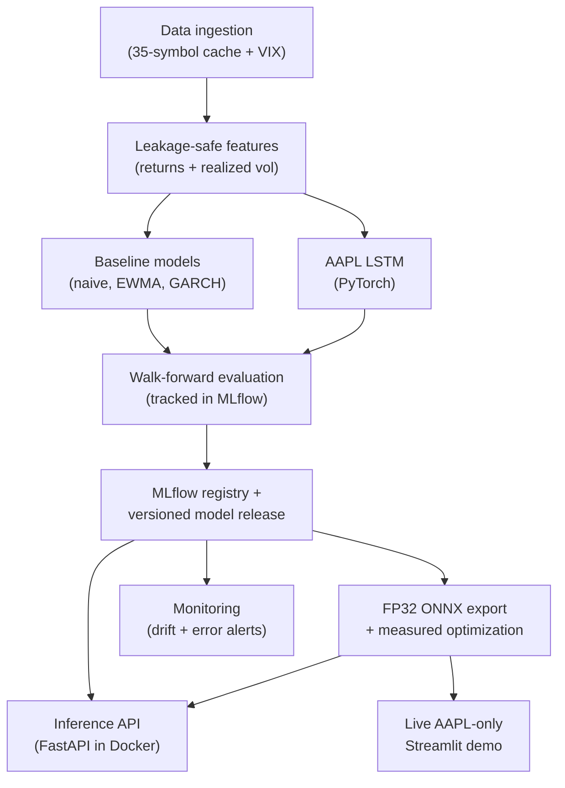

# Volatility Forecasting MLOps

[](https://github.com/ompat5/Volatility-Forecasting-MLOps/actions/workflows/ci.yml)

> An end-to-end MLOps system for five-day AAPL realized-volatility forecasting:
> leakage-safe evaluation, MLflow, FastAPI, Docker, CI, monitoring, optimized
> ONNX inference, and a live Streamlit demo.

## Result

The PyTorch LSTM reached **0.2061 RMSE** and **0.1408 MAE** on AAPL walk-forward
evaluation—about 6% and 7% better than EWMA respectively—while EWMA retained a
small QLIKE edge. The modest result is the point: the project emphasizes honest
time-series evaluation and the production lifecycle rather than an implausible
claim of crushing classical volatility models.

## Demo

**[Open the live AAPL volatility dashboard](https://volatility-forecaster.streamlit.app/)**

The Streamlit demo shows the latest forecast, recent realized volatility,
forecast versus realized history, stored model comparisons, and live monitoring
indicators. It is explicitly AAPL-only because the deployed model is AAPL-only.

## Architecture


```mermaid
flowchart TD
    A["Data ingestion<br/>(35-symbol cache + VIX)"] --> B["Leakage-safe features<br/>(returns + realized vol)"]
    B --> C["Baseline models<br/>(naive, EWMA, GARCH)"]
    B --> D["AAPL LSTM<br/>(PyTorch)"]
    C --> E["Walk-forward evaluation<br/>(tracked in MLflow)"]
    D --> E
    E --> F["MLflow registry +<br/>versioned model release"]
    F --> G["Inference API<br/>(FastAPI in Docker)"]
    F --> J["FP32 ONNX export<br/>+ measured optimization"]
    J --> G
    J --> H["Live AAPL-only<br/>Streamlit demo"]
    F --> I["Monitoring<br/>(drift + error alerts)"]
```

See [docs/BUILD_PLAN.md](docs/BUILD_PLAN.md) for the full evaluation protocol and week-by-week plan.

## Results

All models use the same five-fold expanding-window protocol with a five-day gap.

| Model | RMSE | MAE | QLIKE |
|---|---:|---:|---:|
| Naive | 0.2570 | 0.1698 | 1.6150 |
| EWMA | 0.2195 | 0.1508 | **0.5792** |
| GARCH(1,1) | 0.2441 | 0.1892 | 0.6962 |
| LSTM | **0.2061** | **0.1408** | 0.5822 |

The current production default and monitoring are **AAPL-only**. The repository
caches 34 forecast targets plus VIX context. A global-model migration is now in
progress: its pooled LSTM candidate has been evaluated, packaged, and integrated
behind an opt-in FastAPI route, but it is not the production default, monitored,
or promoted. No basket-level production claim is made until the remaining ONNX,
monitoring, dashboard, immutable-release, and cutover gates pass.

### Global candidate benchmark (not production)

The candidate is one shared LSTM for all 34 forecast targets, with a learned
ticker embedding and same-session VIX context. It trains on log volatility,
returns positive forecasts, balances every ticker in each training batch, and
uses one purged calendar for the whole basket. Five expanding folds selected a
four-epoch final refit, which was scored once on the untouched 252-session
holdout from 2025-06-18 through 2026-06-18 (8,568 observations per model).

| Model | Macro RMSE | Micro RMSE | Micro MAE | Micro QLIKE |
|---|---:|---:|---:|---:|
| Naive | 0.16156 | 0.18064 | 0.11894 | 1.62829 |
| EWMA | 0.12837 | 0.14536 | 0.09694 | 0.54039 |
| GARCH(1,1) | 0.12853 | 0.14436 | 0.09785 | **0.52160** |
| Global LSTM | **0.12581** | **0.14235** | **0.08837** | 0.72611 |

The global LSTM has the best holdout RMSE and MAE, but GARCH retains a clear
QLIKE advantage. At ticker level, the LSTM beats GARCH on RMSE for 21/34
targets, MAE for 28/34, and QLIKE for only 5/34. That mixed result is reported
as-is: it clears the implementation/evaluation gate, not the production
promotion gate. Reproducible configuration, split boundaries, aggregate/group
metrics, and per-ticker holdout metrics are in
[`benchmarks/global_model.json`](benchmarks/global_model.json).

The global artifact bundles its weights, scaler, ticker vocabulary, feature
schema, configuration, and benchmark evidence. Its long-form raw-price contract
and promotion safeguards are documented in
[`docs/GLOBAL_MODEL.md`](docs/GLOBAL_MODEL.md). `POST /predict/global` loads only
when `GLOBAL_MODEL_URI` is explicitly configured; the existing AAPL
`POST /predict`, `/health`, model URI, and backend defaults remain unchanged.

### FP32 ONNX benchmark

The production LSTM core was exported to ONNX and measured on CPU with one
thread per runtime, 100 warm-up calls, and 1,000 timed calls. These are local
Darwin x86_64 measurements, not universal latency guarantees.

| Path | Runtime | Median | p95 |
|---|---|---:|---:|
| Scaled tensor → forecast | PyTorch | 0.3820 ms | 0.7280 ms |
| Scaled tensor → forecast | ONNX FP32 | **0.1036 ms** | **0.2153 ms** |
| Raw prices → forecast | PyTorch | 4.2884 ms | 6.3510 ms |
| Raw prices → forecast | ONNX FP32 | **3.9003 ms** | **6.1185 ms** |

ONNX reduced median core latency by about 73% (3.7× faster), but reduced
end-to-end median latency by about 9% because pandas feature construction and
scaling dominate the full path. The ONNX artifact is 74,079 bytes versus 75,764
bytes for PyTorch (about 2% smaller), and the production forecasts differed by
only `2.98e-08`. The machine-readable result is in
[`benchmarks/onnx_fp32.json`](benchmarks/onnx_fp32.json).

### INT8 quantization decision

Dynamic INT8 quantization was evaluated on the final 60 target-observable AAPL
dates in the cached dataset (2026-03-25 through 2026-06-18). FP32 and INT8 used
identical raw-price windows, features, scaler, and targets.

| Runtime | Size | Core median | End-to-end median | RMSE | MAE | QLIKE |
|---|---:|---:|---:|---:|---:|---:|
| ONNX FP32 | 74,079 B | 0.0755 ms | 3.4405 ms | 0.09472 | 0.08030 | 0.37972 |
| ONNX INT8 | 23,715 B | 0.0701 ms | 3.4142 ms | 0.09331 | 0.07932 | 0.35664 |

INT8 is 68% smaller, but improves median end-to-end latency by less than 1%.
Its forecasts differ from FP32 by `0.0054` on average and `0.0121` at maximum.
The slightly better metrics on this small slice are treated as quantization
noise, not a model improvement. **Decision: keep FP32 as the optimized serving
candidate** because the roughly 50 KiB saving and negligible application-level
speedup do not justify the larger numerical deviation. The full evidence is in
[`benchmarks/onnx_int8.json`](benchmarks/onnx_int8.json).

## How to run

```bash
uv sync
uv run pytest
uv run ruff check .
```

Build and evaluate the global candidate (the full run includes 204 per-fold and
holdout GARCH fits):

```bash
uv run python -m scripts.build_global_panel
uv run python -m scripts.build_global_splits
uv run python -m scripts.evaluate_global_model
uv run python -m scripts.train_global
uv run python -m scripts.export_global_model --version 3  # use the printed version
```

Train and register the current AAPL production model:

```bash
uv run python -m src.data.ingest
uv run python -m scripts.train
```

Run the API from the local MLflow registry:

```bash
uv run uvicorn src.serving.app:app --port 8000
curl http://127.0.0.1:8000/health
```

Opt into the global candidate with an explicit registry version:

```bash
GLOBAL_MODEL_URI=models:/global-volatility-lstm/3 \
  uv run uvicorn src.serving.app:app --port 8000
curl http://127.0.0.1:8000/health/global
```

`POST /predict/global` accepts `observations`, a long-form list of
`{date, ticker, adjusted_close}` records. Include `^VIX` and one or more known
targets; the response contains one positive five-session forecast per target.
The service validates the loaded artifact against the exact 34-target universe
at startup. Omitting `GLOBAL_MODEL_URI` leaves this endpoint unavailable with
HTTP 503 while the AAPL service continues normally.

Or explicitly opt into the FP32 ONNX backend after exporting the local model:

```bash
uv run python -m scripts.export_model
uv run python -m scripts.export_onnx
MODEL_BACKEND=onnx uv run uvicorn src.serving.app:app --port 8000
```

MLflow remains the default backend. The ONNX path loads the graph and scaler
once at API startup and preserves the same raw-price request contract.

Build the production container from an exported registered model:

```bash
uv run python -m scripts.export_model
docker build -t volatility-forecaster .
docker run --rm -p 8000:8000 volatility-forecaster
```

The image still bakes in only the AAPL production artifact. To exercise the
separately exported global candidate without changing that image default, mount
the immutable snapshot explicitly:

```bash
docker run --rm \
  -e GLOBAL_MODEL_URI=/app/global_model \
  -v "$(pwd)/global_model:/app/global_model:ro" \
  -p 8000:8000 volatility-forecaster
```

To exercise the optimized backend in that image:

```bash
docker run --rm -e MODEL_BACKEND=onnx -p 8000:8000 volatility-forecaster
```

Export the trained LSTM core to a validated FP32 ONNX graph:

```bash
uv run python -m scripts.export_onnx
uv run python -m scripts.benchmark_inference
uv run python -m scripts.quantize_onnx
```

The ONNX graph accepts scaled tensors shaped `(batch, 30, 4)`. Raw-price
feature construction and the fitted `StandardScaler` intentionally remain in
Python so optimization does not change the model's preprocessing contract.

Run the AAPL dashboard with fresh market data:

```bash
uv run streamlit run dashboard/app.py
```

For a fully offline, reproducible view using the cached AAPL prices:

```bash
DASHBOARD_PRICES_PATH=data/raw/AAPL.parquet \
  uv run streamlit run dashboard/app.py
```

The dashboard reuses local model artifacts when available. If they are absent,
it downloads the checksum-pinned `aapl-lstm-v1` release into temporary storage
and exports the FP32 ONNX graph once per application process.

See [the monitoring runbook](docs/MONITORING.md) for the scheduled workflow,
thresholds, artifacts, and local monitoring commands.

## Status

Phases 1–5 are complete. Phase 6 optimization and demo work is merged to `main`:
FP32 ONNX export, parity validation, benchmarks, the measured INT8 decision, an
opt-in ONNX API backend, and the public AAPL-only Streamlit dashboard are all
implemented. Global migration Phases 1–5 now add the complete pooled-model path
through opt-in API and container validation without changing that production
default. The current branch has **170 tests**. Remaining global work is ONNX,
monitoring, dashboard, immutable release, and eventual cutover; final portfolio
polish follows the migration.

### Continuous integration

Every push and pull request runs Ruff, the pytest suite, a Docker build, and two
end-to-end container smoke tests. The first uses the deterministic AAPL fixture
and proves global serving is disabled by default. The second mounts a separate
deterministic global fixture and requires all 34 target forecasts. Neither
fixture is trained or ever published.

Production images continue to use an explicitly exported registered model:

```bash
uv run python -m scripts.export_model
docker build -t volatility-forecaster .
```

### Scheduled monitoring

A weekday GitHub Actions pipeline refreshes AAPL data, downloads the immutable
checksum-pinned production model, generates a forecast, and reports feature
drift, volatility-regime state, and delayed rolling forecast error. Predictions,
the input snapshot, and Markdown/JSON reports are retained as workflow artifacts.

See [docs/MONITORING.md](docs/MONITORING.md) for thresholds, methodology, and
local commands.
