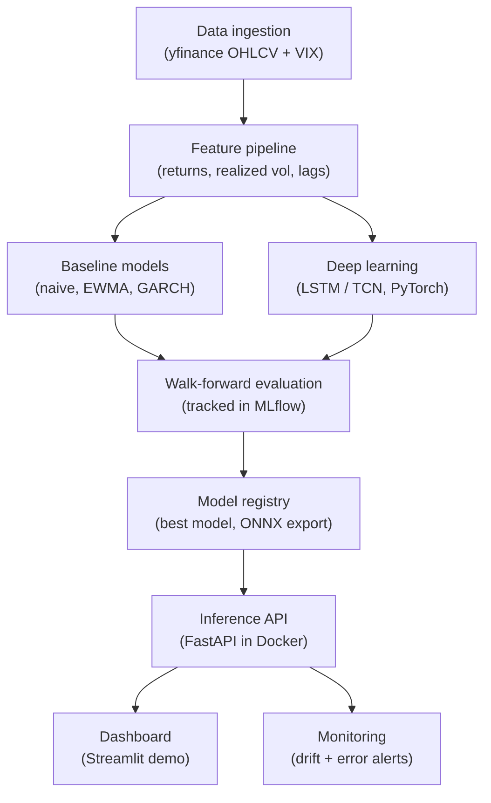

# Project 1 — Deep Learning Volatility Forecasting with Full MLOps

**Modern ML / ML Engineer resume track**

---

## The project in one sentence

Build a system that forecasts the future **realized volatility** of a basket of stocks/ETFs using a deep learning model, benchmark it honestly against the classical econometric standard (GARCH), and wrap the whole thing in a production engineering lifecycle: experiment tracking, a deployed API, automated CI/CD, drift monitoring, inference optimization, and a live demo.

## Why this is the right project (and defensible in an interview)

- **You are NOT predicting price.** Predicting prices/returns is near-impossible (efficient markets), and a project claiming to do it well signals data leakage to anyone who knows finance. Avoid it.
- **Volatility clusters.** Calm follows calm, turbulence follows turbulence. This is a real, well-documented statistical property, so volatility is genuinely forecastable. That makes your modest, honest results *credible*.
- **It feeds your options interest.** Volatility is the core of options pricing (implied vol, the VIX, Black-Scholes). This project is the natural on-ramp to the options world you want to learn.
- **The MLOps wrapper is the star.** The model is the vehicle; what gets you hired is everything in the purple boxes of the architecture diagram — the part most candidates never build.

---

## Glossary: every unfamiliar term in one line

Read this once. You'll meet each tool again in the phase where you actually use it.

| Term | What it is, in one line |
|---|---|
| **Realized volatility** | A measure of how much an asset's returns actually bounced around over a window (e.g. the standard deviation of recent daily returns). This is your prediction target. |
| **Implied volatility / VIX** | The volatility the *options market* expects going forward. The VIX is the implied vol of the S&P 500. Used later as a feature and as the options tie-in. |
| **GARCH** | The classic statistical model for forecasting volatility. Your respected baseline — beating or matching it is the benchmark that proves your DL model is real. |
| **Walk-forward validation** | Time-series cross-validation that only ever trains on the past and tests on the future. The discipline that prevents data leakage. The single most important methodological idea here. |
| **LSTM / TCN** | Two neural network architectures for sequence data. LSTM (recurrent) is the standard starting point; TCN (temporal convolution) is a strong, simpler-to-train alternative. |
| **PyTorch** | The deep learning library you'll train the model in. |
| **MLflow** | Tracks every training run (parameters, metrics, model files) so you can compare experiments and register your best model. "Experiment tracking + model registry." |
| **FastAPI** | A Python library for building a web API. You'll wrap your model in one so others can send it data and get a forecast back. |
| **Docker** | Packages your app + all its dependencies into a portable "container" that runs identically anywhere. "It works on my machine" — solved. |
| **CI/CD (GitHub Actions)** | Automation that runs your tests and builds your Docker image every time you push code. CI = continuous integration, CD = continuous delivery. |
| **ONNX** | An open format you export your trained model to, so it runs faster and lighter at inference time. Pairs with quantization (shrinking the model to INT8). |
| **Drift detection** | Monitoring that fires an alert when incoming data stops looking like the training data — e.g. a market regime shift. Finance gives you the most natural possible example of drift. |
| **Streamlit** | The fastest way to turn a Python script into a simple interactive web dashboard for your demo. |

---

## Architecture recap

Color logic from the chat diagram: **data work** (ingestion, features), **modeling + honest evaluation** (baselines, DL, walk-forward), and **production engineering** (registry, API, dashboard, monitoring). The last group is what differentiates you.

---

## The exact evaluation protocol (read before you write any model code)

This is the methodological heart of the project. Get this right and the rest is engineering.

1. **Target:** For each ticker and each day *t*, predict the realized volatility over the next *h* days (start with *h* = 5, the trading week). Compute realized vol as the standard deviation of daily log returns over the window, annualized.
2. **Walk-forward / expanding window:** Sort by date. Train on days `[start … t]`, validate on the next block, then roll forward and repeat. **Never shuffle. Never let test dates appear before train dates.**
3. **Fit scalers on training data only.** Compute means/std for feature scaling from the *training* slice and apply them to validation/test. Fitting on the whole dataset is the most common silent leak.
4. **Lag your features correctly.** A feature available at prediction time *t* must only use information known at *t* or earlier. Double-check that realized-vol features aren't accidentally peeking into the target window.
5. **Metrics:** Report **RMSE** and **MAE** on volatility, plus **QLIKE** (a loss function designed specifically for volatility forecasts that penalizes under-prediction appropriately). Compare DL vs GARCH vs naive on the *same* walk-forward splits.
6. **Expected honest result:** Your DL model may only *modestly* beat GARCH, especially at short horizons, and may tie it at others. That is a credible, mature finding — report it plainly. Claiming you crushed GARCH is a red flag.

---

## Datasets and libraries

**Data (all free):**
- `yfinance` — daily OHLCV (open/high/low/close/volume) for any ticker. Start with ~30–50 liquid names (large-cap stocks + sector ETFs) plus `^VIX`.
- Optionally `pandas-datareader` / Stooq as a backup source.
- Aim for ~10–15 years of daily history per ticker — enough to span multiple volatility regimes (2008, 2020, etc.), which makes your drift story real.

**Core libraries by phase:**
- Data/features: `pandas`, `numpy`
- Baselines: `arch` (GARCH), `statsmodels`
- Deep learning: `torch` (PyTorch), optionally `pytorch-lightning` for cleaner training loops, `scikit-learn` for scaling/metrics
- Tracking: `mlflow`
- Config: `hydra-core` or plain YAML
- Serving: `fastapi`, `uvicorn`, `pydantic`
- Containers/CI: Docker, GitHub Actions (no install — it's a YAML file in your repo)
- Optimization: `onnx`, `onnxruntime`
- Monitoring: `evidently` (drift reports) or a small custom check
- Demo: `streamlit`

---

## Week-by-week build plan (~7–8 weeks part-time)

Each phase ends with something you can commit, push, and point to. Build the MVP path first; circle back for stretch items once the end-to-end loop works.

### Phase 0 — Setup and foundations (2–3 days)
**Goal:** A clean, professional repo skeleton.
- Install Python (use `uv` or `conda` for environments), set up VS Code, create a GitHub repo.
- Lay out a sane structure: `data/`, `src/` (with `features/`, `models/`, `serving/`), `notebooks/`, `tests/`, `configs/`, `README.md`, `requirements.txt` (or `pyproject.toml`).
- Learn the minimum Git workflow: branch, commit, push, pull request.
- **Deliverable:** Empty-but-structured repo on GitHub with a README skeleton (Hook / Demo / Architecture / Results / How to run — fill in as you go).

### Phase 1 — Data and baselines (Week 1)
**Goal:** Forecast volatility with classical methods first, and nail the evaluation harness. *This is the most important week.*
- Pull OHLCV for your basket with `yfinance`; cache to local Parquet/CSV.
- Compute daily log returns and realized volatility; build the target (next-*h*-day realized vol).
- Build the **walk-forward split function** and the metrics (RMSE, MAE, QLIKE).
- Implement three baselines: naive (last value), EWMA, and GARCH(1,1) via `arch`.
- Produce a metrics table comparing the three on identical splits.
- **Learn:** realized vs implied vol, volatility clustering, the leakage trap, proper backtest splits.
- **Deliverable:** A notebook + a reusable `src/` module that outputs a baseline metrics table. You now have a benchmark to beat.

### Phase 2 — The deep learning model (Weeks 2–3)
**Goal:** A PyTorch sequence model that matches or beats GARCH on your splits.
- Build a windowed dataset: each sample is a sequence of the last *N* days of features → next-*h*-day realized vol.
- Start with an **LSTM or GRU**. Train a single **global** model across all tickers (more data, more impressive than one model per ticker); add a ticker embedding as a stretch.
- Fit scalers on train only; respect the walk-forward protocol from Phase 1.
- Evaluate against GARCH/naive on the same splits. Plot predictions vs actuals.
- **Stretch:** swap in a **Temporal Convolutional Network (TCN)** or a small Transformer encoder and compare.
- **Learn:** sequence modeling, windowing, overfitting control (early stopping, dropout), honest train/val/test discipline.
- **Deliverable:** Trained model + a DL-vs-baseline comparison table and plot.

### Phase 3 — Experiment tracking and reproducibility (Week 3–4)
**Goal:** Make every result reproducible and comparable.
- Wrap training so each run logs params, metrics, and artifacts to **MLflow**.
- Move hyperparameters into a **config file** (Hydra/YAML); set random seeds.
- Register your best model in the **MLflow model registry**.
- **Learn:** experiment tracking, model registry, reproducibility — core MLOps vocabulary.
- **Deliverable:** MLflow UI showing multiple compared runs, a registered "best" model, a config-driven `train.py`.

### Phase 4 — Serving and containerization (Week 4–5)
**Goal:** Anyone can send a request and get a forecast.
- Build a **FastAPI** service: an endpoint that accepts a ticker (or a recent feature window) and returns a volatility forecast plus a prediction interval. Load the registered model.
- Validate inputs/outputs with `pydantic`. Write a couple of `pytest` tests.
- **Dockerize** it; confirm it runs in a container with one command.
- **Learn:** model serving, REST APIs, containers.
- **Deliverable:** A running containerized API with an example `curl` command in the README.

### Phase 5 — Automation, CI/CD, and monitoring (Week 5–6)
**Goal:** The system maintains and watches itself.
- Add a **GitHub Actions** workflow: on every push, run linting (`ruff`) + tests (`pytest`) + build the Docker image.
- Add a scheduled job (GitHub Actions `cron`, or `Prefect` as a stretch) that refetches data daily, regenerates forecasts, and logs predictions.
- Add **drift + error monitoring** (`evidently` or custom): track feature drift and rolling prediction error; fire an alert (log line or Slack webhook) when a threshold is breached.
- **The finance payoff:** a volatility *regime shift* (a market stress event) is a textbook example of real distribution drift. Write this up — it's a standout narrative most portfolios can't tell honestly.
- **Learn:** CI/CD, light orchestration, drift detection.
- **Deliverable:** A green CI badge, a scheduled pipeline, and a drift/monitoring report.

### Phase 6 — Optimization, demo, and polish (Week 6–7)
**Goal:** Make it fast, make it visible, make it legible.
- Export the model to **ONNX**; optionally quantize to INT8. Benchmark **inference latency and model size** before vs after, and report the accuracy delta. (This is the differentiator most candidates never touch.)
- Build a **Streamlit** dashboard: pick a ticker → see forecast vs realized vol, DL-vs-GARCH comparison, and a drift indicator. Deploy it (Streamlit Community Cloud or Hugging Face Spaces).
- Finish the **README** (one-line hook, demo GIF, architecture diagram, results table with metrics, clear run instructions) and write **one short blog post** explaining your key decisions and trade-offs.
- **Deliverable:** A live demo link, a polished repo, and a write-up.

---

## MVP vs stretch

**Minimum viable (ship this first, then apply):**
Data + features → walk-forward eval → GARCH baseline → one LSTM that matches/beats it → MLflow tracking → FastAPI in Docker → basic README + Streamlit demo.

**Stretch (depth that impresses):**
TCN/Transformer comparison · global model with ticker embeddings · ONNX + INT8 with a latency/size benchmark · drift monitoring with the regime-shift write-up · scheduled daily pipeline · the options tie-in below.

---

## The options tie-in (high-value stretch, directly serves your interest)

Once the core works, add a comparison between your **forecasted realized volatility** and the **option-implied volatility** (use the VIX for index-level work, or pull an option chain for a single name). The question — *"is the market over- or under-pricing future volatility right now?"* — is exactly how volatility traders think. Frame it as analysis, not a trading strategy, and you've connected this project straight to the options domain you're trying to learn.

---

## Resume bullet target

> Built and deployed an end-to-end deep learning system forecasting 5-day realized volatility across 40 equities; a global LSTM in PyTorch matched a GARCH(1,1) baseline on walk-forward QLIKE while improving multi-step RMSE by X%. Tracked experiments in MLflow, served via FastAPI + Docker with GitHub Actions CI/CD, added drift monitoring that flags volatility-regime shifts, and cut inference latency Nx via ONNX INT8 quantization with <2% accuracy loss.

(Fill in the real numbers — honest, modest numbers are more credible than impressive ones.)

---

## Common pitfalls to avoid

- **Data leakage** — the #1 killer. Fit scalers on train only; never shuffle time series; verify feature lags.
- **Predicting price/returns instead of volatility** — instant credibility loss.
- **Claiming you crushed GARCH** — a modest win or a tie is the honest, expected outcome.
- **Stopping at the notebook** — the deployment, monitoring, and optimization are the whole point of this project.
- **A messy repo** — reviewers spend ~30 seconds. The README and a live demo carry enormous weight.
